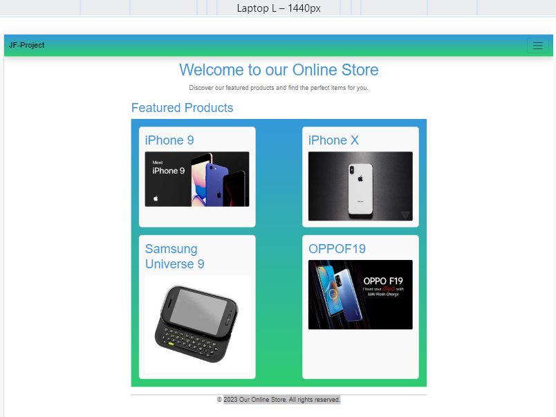
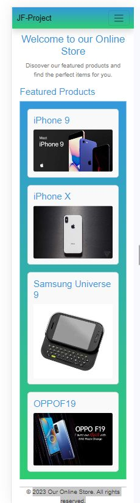
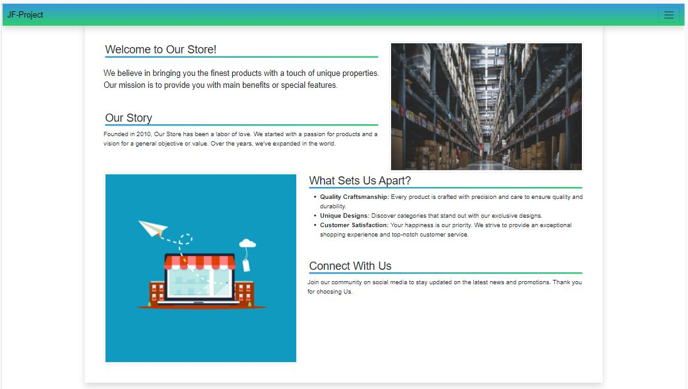
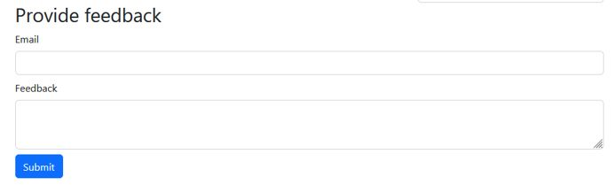
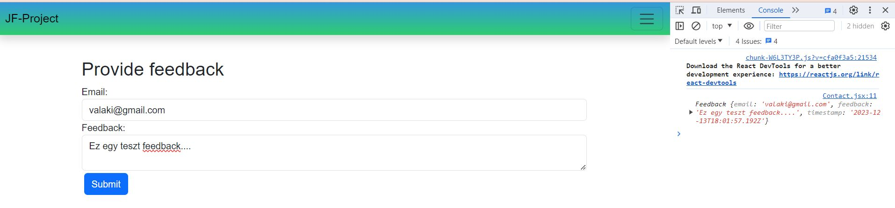
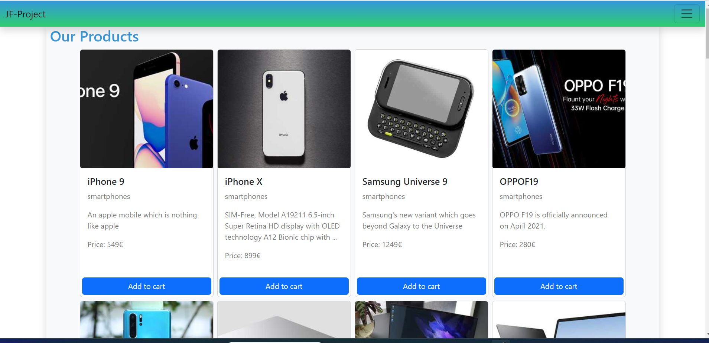

# React + Vite project sample

## Products

Egy bolt félig kész weboldalát kellene befejezni, az alábbi követelmények szerint:

- A félig kész weboldal egy  React – Vite projekt, **pnpm** csomagkezelővel létrehozva
- A félig kész projektet innen klónozd le a saját gépedre a munkakönyvtáradba
- A projekt tartalmaz pár automata tesztesetet is, melyek a Vitest keretrendszerrel vannak megvalósítva. A test mappa alatt találhatóak és ezeket nem kell/nem szabad módosítani.
A sikeres megoldás esetén minden teszt helyesen le fog futni.A tesztesetek futtatása:
    > pnpm run test
- a munkát egy GitHub repoba kell feltölteni és a repo URL-jét leadni
- a repo neve **JF_vizsga** legyen
- a repo tartalmazzon egy Readme.md fájlt amelyben szerepelnek az alábbi adatok:
  - a publikált produktum URL-jét
  - a vizsgázó nevét
- A **package.json** fájl tartalmazza a feladatok megoldásához szükséges függőségeket, új csomag telepítése nem szükséges (de megengedett).
- A tesztesetek sikeres futtatása szükséges, de nem elégséges feltétele a feladatok megoldásának, az alkalmazásnak a szöveges leírásnak is meg kell felelnie.
- Az elkészített programkódnak a funkcionalitás mellett a tiszta kód elveinek is meg kell felelnie – nehezen áttekinthető kódért pontlevonás, teljesen olvashatatlan kódért pedig akár 0 pont is járhat.
  
### 1.feladat- Az alkalmazás főoldalának a kialakítása

- Készítsen egy új komponenst a főoldal számára, a neve legyen: **Home**. 
- Állítsa be, hogy a „/” route ezt a komponenst használja.
- a főoldal szerkezete/szövege a minta szerint legyen kialakítva, betartva az alábbiakat:

  - tartalmazzon 3 szemantikus elemet: **header, main** és **footer**
  - a header-ben legyen egy **egyes szintű címsor** és egy **bekezdés** a mintán látható szöveggel
  - a main tartalmazzon egy **kettes szintű címsor** a minta szerint és egy **FeaturedProducts** nevű komponenst, amely megjeleníti a kiemelt termékeket
  - a kiemelt termékek adatait a projekt mappa alatt található **data.js** fájlban találjuk meg
  - a footer elemben levő bekezdés tartalma a minta szerinti szöveget tartalmazza
  - a főoldal formázásához használhatja a bootstrap keretrendszert is de nem kötelező
  - a főoldalon megjelenített tároló szélessége amiben a termékek megjelennek ne legyen **800px** -nél nagyobb
  - a színátmenetes háttér kialakításához és az oldalon előforduló színeknek használja a **#3498db** és a **#2ecc71** értékeket.
  
  

### 2.feladat- a bolt és cég története

- Készíts egy új komponenst amiben bemutatkozik a céged, a neve legyen **About.jsx**
- egészítsd ki a menüt ezzel az új oldallal, valósítsd meg a routingolást is, hozz létre egy **about** route-t ennek a komponensnek
- a megjelenítendő szöveget az **about.txt** fájlban találod, tagold a szöveget címsorokra és bekezdésekre
- a megjelenítendő képeket pedig az **assets** mappában:**about1.jpg** és **about2.jpg**
- Formázd meg az oldalt bootstrap (vagy ekvivalens keretrendszer) segítségével!
- A kinézet körülbelül feleljen meg a mintának.

### 3.feladat- kapcsolat oldal kialakítása

  A **Contact.jsx** komponens tartalmát kell kialakítani az alábbiak szerint:

- hozz létre egy „Provide feedback” szekciót a minta szerint és benne készíts egy űrlapot
- a űrlapnak legyen egy  „Email” mezője, melyben egy email címet lehessen megadni
- s legyen egy „Feedback” mező, melyben egy többsoros szöveget lehessen megadni
- A „Submit” egy gomb legyen, amely segítségével el lehet küldeni az űrlapot
- Az űrlapot nem szükséges validálni, feldolgozni.
- a submit esmény bekövetkeztekor az űrlapadatokat tároljuk el egy olyan objektumba,  melynek van  **email**, **feedback** és **timestamp** attribútuma
- a submit esemény bekövetkeztekor a létrehozott objektumot jelenítsük meg a konzolban

### 4.feladat- a termékek bemutatása

Készítsd el a termékeket bemutató oldalt, a **Products.jsx** komponensben.
Az adatok az alábbi linken érhetőek el, JSON formátumban vannak:
[products](https://raw.githubusercontent.com/mkatay/json_products/main/products)
Olvasd be az adatokat az **axios** API-val és tárold el őket egy state-ben ebben a komponensben.
Csak pár adatot kell megjeleníteni : **id**, **title**, **category**, **description**, **price** és **thumbnnail**.
Hozz létre egy **SingleProduct.jsx** komponenst és abban valósítsd meg a termék kártya formájú megjelenítését.

### 5.feladat- verziókezelés, GitHub repository létrehozása

### 6.feladat- publikálás

